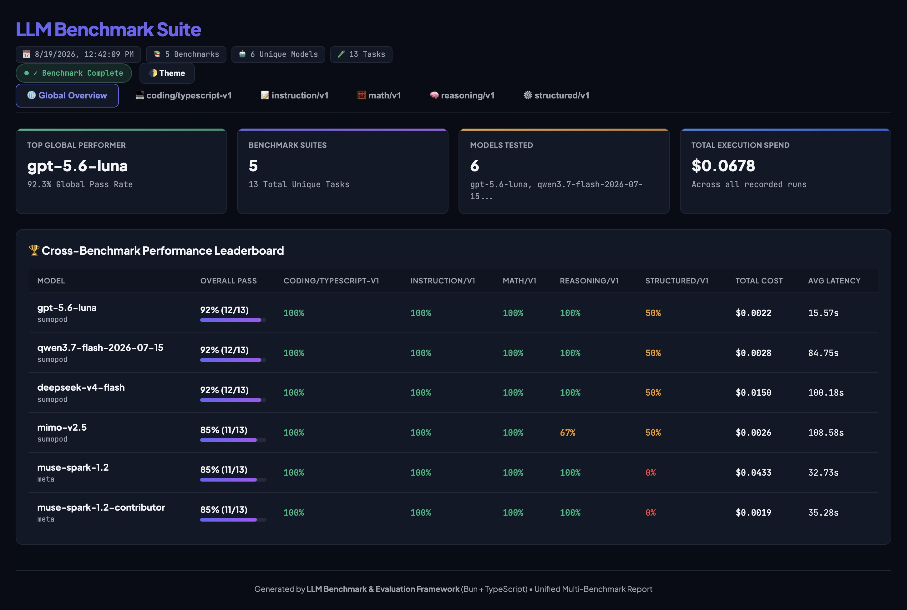

# LLM Benchmark & Evaluation Framework

A lightweight, high-performance LLM Benchmark & Evaluation Framework built from scratch with **Bun + TypeScript** and pure JSON stream storage.

Strictly focused on **measuring raw model capabilities** (coding, reasoning, math, instruction following, structured output) with deterministic evaluators, reproducible datasets, isolated workspaces, live streaming HTML dashboards, and zero database or heavy harness dependencies.



---

## Key Highlights

- **Decoupled Architecture**: Benchmark tasks and evaluators are 100% decoupled from model providers.
- **Multi-Provider Support**:
  - Universal OpenAI-compatible gateway (Meta AI, SumoPod, OpenRouter, Ollama, vLLM, LM Studio, Groq, Together, DeepSeek, custom endpoints)
  - Native OpenAI, Anthropic, and Google Gemini clients
  - Offline Mock provider for fast, deterministic testing and dry-runs
- **Model Enable/Disable Control**: Explicit `"enabled": true` / `"enabled": false` toggle in `models.json` to control which models are available for benchmark runs.
- **Pure JSON Stream Storage (No DB Dependency)**:
  - Benchmark runs stream directly into `reports/${YYYY-MM-DD_HH-mm-ss}_report.json` and `reports/${YYYY-MM-DD_HH-mm-ss}_report.html`.
  - Zero database setup or schema migrations needed.
- **Live Streaming HTML Dashboard**:
  - Auto-refresh polling every 10 seconds while benchmarks run.
  - Automatically stops refreshing when all tasks complete.
  - Dark/light theme dashboard with KPIs, global cross-benchmark matrix, and tab navigation per category.
  - Displays **Master Prompt**, **Evaluation Target Criteria**, and individual model candidate responses.
- **Batch Run All Command (`--all`)**:
  - Run all available benchmark suites sequentially with a single command: `bun run bench run --all`.
- **Deterministic Evaluators**:
  - Exact Match (with case-insensitive and numeric normalizations)
  - Contains (single and multi-substring with `all`/`any` modes)
  - Regular Expression pattern matching
  - JSON Schema validation & JSON structure extraction
  - Command & Test Evaluator for coding tasks with live stdout/stderr/pass/fail parsing
  - LLM Judge (as fallback with separate judge model tracking)
- **Coding Task Engine**:
  - Immutable filesystem dataset fixtures
  - Ephemeral temporary workspaces (`/tmp/llm-bench/...`)
  - Structured file replacement patches (`{"files": {"src/user.ts": "..."}}`)
  - Subprocess test execution (`bun test`) and automatic workspace cleanup

---

## Quick Start

### 1. Configure API Keys in `.env`

Copy `.env.example` to `.env` and insert your API keys:

```env
# Meta AI API (https://api.meta.ai/v1)
META_API_KEY=your_meta_api_key_here

# SumoPod API (https://ai.sumopod.com/v1)
SUMOPOD_API_KEY=your_sumopod_api_key_here

# Other Providers
OPENROUTER_API_KEY=your_openrouter_api_key_here
OPENAI_API_KEY=your_openai_api_key_here
ANTHROPIC_API_KEY=your_anthropic_api_key_here
GEMINI_API_KEY=your_gemini_api_key_here

# Optional default fallback key for custom endpoints
API_KEY=your_default_api_key_here
```

### 2. Inspect Available Benchmarks & Models

```bash
# List all discovered benchmark suites
bun run bench list

# List all configured models and their ENABLED / DISABLED status
bun run bench models
```

### 3. Run Benchmarks

```bash
# Run ALL benchmarks sequentially across all enabled models (streams live to reports/)
bun run bench run --all --concurrency 3

# Run a specific benchmark suite
bun run bench run coding/typescript-v1 --concurrency 2

# Run specific tasks
bun run bench run math/v1 --task math-001,math-002

# Run with custom sampling parameters
bun run bench run reasoning/v1 --temperature 0.0 --max-tokens 4096
```

### 4. View Reports & Live Dashboard

```bash
# Open the generated live streaming HTML dashboard
open reports/2026-08-19_12-14-22_report.html

# View terminal summary from recorded reports
bun run bench report

# Export or rebuild HTML report from latest JSON stream
bun run bench html

# Inspect detailed task result (latency, tokens, cost, modified files, test output)
bun run bench result run_20260819_121422_8efd --task math-001

# Compare multiple runs
bun run bench compare run_xxx run_yyy
```

---

## Understanding Concurrency (`--concurrency` / `-c`)

In this framework, **concurrency** controls **how many benchmark tasks are dispatched to the model API in parallel simultaneously**, rather than waiting for each task to complete sequentially before starting the next.

### Sequential (`--concurrency 1`) vs Parallel (`--concurrency 5`)

```text
--concurrency 1 (Sequential)
Task 1 [5s] ──► Task 2 [5s] ──► Task 3 [5s] ──► Task 4 [5s] ──► Task 5 [5s]
Total Time: 25 seconds

--concurrency 5 (Parallel Worker Pool)
Worker 1: Task 1 [5s] ──► Task 6 [5s]
Worker 2: Task 2 [5s] ──► Task 7 [5s]
Worker 3: Task 3 [5s] ──► Task 8 [5s]
Worker 4: Task 4 [5s] ──► Task 9 [5s]
Worker 5: Task 5 [5s] ──► Task 10 [5s]
Total Time: ~10 seconds (2.5x speedup)
```

### How It Works Under the Hood

- **Worker Pool Queue (`src/core/runner.ts`)**: Dispatches requests up to the specified concurrency ceiling. As soon as any worker completes a task, it immediately picks the next task from the queue.
- **Isolated Workspace per Worker**: For coding benchmarks, each concurrent worker operates within its own isolated ephemeral workspace in `/tmp/llm-bench/...` ensuring zero test execution collisions.

### Recommended Concurrency Guidelines

| Environment / Provider | Recommended Concurrency | Purpose |
|---|---|---|
| **High-throughput Cloud APIs (OpenAI, Gemini, OpenRouter)** | `--concurrency 5` to `10` | Drastically reduces total benchmark duration (e.g. 100 tasks in ~1 minute). |
| **Tier-Limited / Rate-Sensitive APIs** | `--concurrency 1` to `3` | Prevents HTTP 429 (*Too Many Requests*) rate limit errors. |
| **Local Inference (Ollama / vLLM on local GPU)** | `--concurrency 1` to `2` | Avoids overloading VRAM and GPU compute queues. |

---

## Benchmark Suites Included

| Benchmark Suite | Type | Description | Evaluator |
|---|---|---|---|
| **`coding/typescript-v1`** | `coding` | Fix bugs and implement features in isolated temporary workspaces | `bun test` runner & parser |
| **`reasoning/v1`** | `reasoning` | Multi-step logical deductions, truth-teller riddles, runner sequences | Exact match / Contains |
| **`math/v1`** | `math` | Arithmetic, algebra, and prime factorizations | Exact match / Numeric |
| **`instruction/v1`** | `instruction` | Negative constraints, strict formatting, and word order rules | Regex / Exact match |
| **`structured/v1`** | `structured` | JSON Schema compliance and structured extraction | JSON Schema validator |

---

## Interactive HTML Dashboard Features

- **Pulsing Live Status Badge**: Indicates live benchmark execution with 10s auto-refresh; automatically stops and updates to `✓ Benchmark Complete` when finished.
- **Executive KPIs**: Top Performer, Lowest Cost, Fastest Model, and Best Value (Score per Dollar).
- **Cross-Benchmark Leaderboard Matrix**: Compares models side-by-side across all benchmark categories.
- **Tab Navigation**: Instant switching between the Global Overview and individual benchmark category tabs.
- **Task Deep Dive**:
  - 📋 **Master Prompt / Instruction**: Exact prompt and instructions delivered to the model.
  - 🎯 **Evaluation Target / Expected Criteria**: Exact target string, regex pattern, JSON schema, or `bun test` validation command.
  - 🤖 **Model Candidate Outputs**: Individual model responses, test statistics, modified file lists, latency, cost, and tokens.
- **Search & Filter Bar**: Instant filtering by task ID, prompt text, model name, and pass/fail status.
- **Dark/Light Theme Toggle**: Clean responsive dashboard with persistent theme setting.

---

## Model Configuration (`llm-bench/models.json`)

Models are configured in `models.json` and can be toggled using `"enabled"`:

```json
{
  "models": [
    {
      "id": "qwen3.7-flash-2026-07-15",
      "provider": "sumopod",
      "model": "qwen3.7-flash-2026-07-15",
      "baseUrl": "https://ai.sumopod.com/v1",
      "enabled": true,
      "pricing": {
        "input": 0.03,
        "output": 0.13
      },
      "contextWindow": 128000
    },
    {
      "id": "muse-spark-1.2-contributor",
      "provider": "meta",
      "model": "muse-spark-1.2-contributor",
      "baseUrl": "https://api.meta.ai/v1",
      "enabled": true,
      "pricing": {
        "input": 0.10,
        "output": 0.20
      },
      "contextWindow": 128000
    },
    {
      "id": "ollama-local",
      "provider": "compatible",
      "model": "qwen2.5-coder:7b",
      "baseUrl": "http://localhost:11434/v1",
      "enabled": false
    }
  ]
}
```

*Note: Disabled models cannot be run in benchmarks and will be rejected with an informative error.*

---

## CLI Command Reference

```text
USAGE:
  bench <command> [options]

COMMANDS:
  list                          List all available benchmarks
  models                        List configured models in models.json
  run <benchmark-id>|--all      Run a benchmark (or all benchmarks) against enabled models
  report [run-id|all]           View summary report from recorded JSON reports
  html [run-id] [output.html]   Generate an interactive HTML benchmark report
  result <run-id>               Inspect per-task results
  compare <run-id-1> [run-id-2] Compare multiple benchmark runs side-by-side

OPTIONS for 'run':
  --all, -a                     Run all discovered benchmarks sequentially
  --model, -m <model-id>        Model(s) to benchmark (can specify multiple times)
  --task, -t <task-ids>         Comma-separated list of specific task IDs to run
  --concurrency, -c <number>    Concurrency limit for tasks (default: 1)
  --temperature <number>        Sampling temperature for model requests
  --max-tokens <number>         Max generation tokens
  --config <path>               Custom models config path (default: ./models.json)
  --benchmarks-dir <path>       Custom benchmarks folder (default: ./benchmarks)
  --reports-dir <path>          Custom reports folder (default: ./reports)
  --keep-workspaces             Keep temporary workspace directories for debugging
  --html <path>                 Custom HTML report destination
  --json <path>                 Custom JSON stream destination
```

---

## Project Structure

```
.
├── llm-bench/
│   ├── src/
│   │   ├── cli/         # CLI commands (list, models, run, report, result, compare, html)
│   │   ├── core/        # Core abstractions (model, task, evaluator, benchmark, runner, result, workspace, coding)
│   │   ├── providers/   # AI providers (compatible, openai, anthropic, google, openrouter, mock)
│   │   ├── evaluators/  # Deterministic evaluators (exact, contains, regex, json, test, llm-judge)
│   │   ├── benchmarks/  # Benchmark filesystem loader and dataset SHA-256 hasher
│   │   └── storage/     # Pure JSON filestore (stream & report persistence)
│   │
│   ├── benchmarks/      # Filesystem benchmark datasets
│   │   ├── coding/typescript-v1/
│   │   ├── reasoning/v1/
│   │   ├── math/v1/
│   │   ├── instruction/v1/
│   │   └── structured/v1/
│   │
│   ├── reports/         # Generated date-time prefixed JSON streams & HTML reports
│   ├── tests/           # Unit & integration test suites
│   ├── models.json      # Model configurations, pricing, and enabled flags
│   └── package.json
│
├── package.json         # Root workspace scripts
└── README.md
```

---

## Running Tests & Typecheck

```bash
# Run unit & integration test suite (46 tests)
bun test

# Run TypeScript typecheck (0 errors)
bun run typecheck
```
